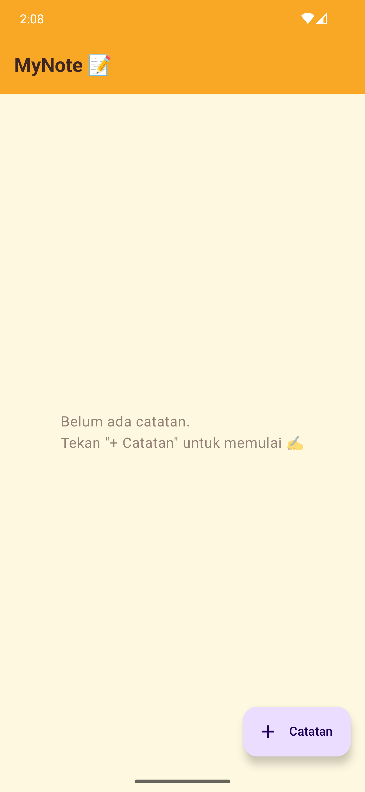
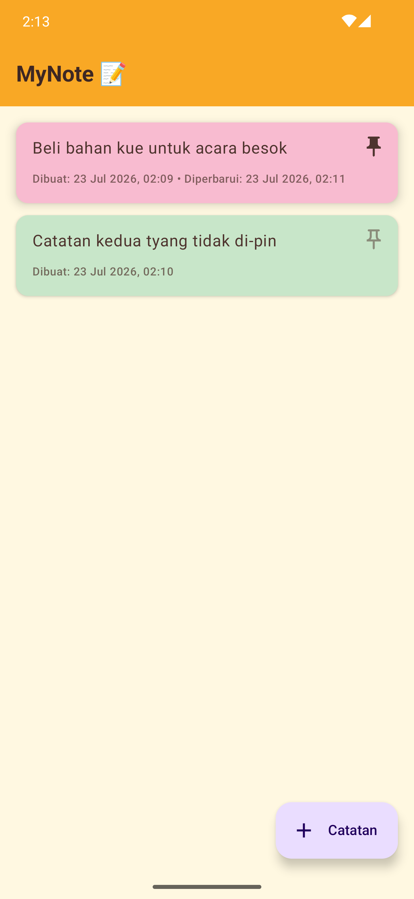
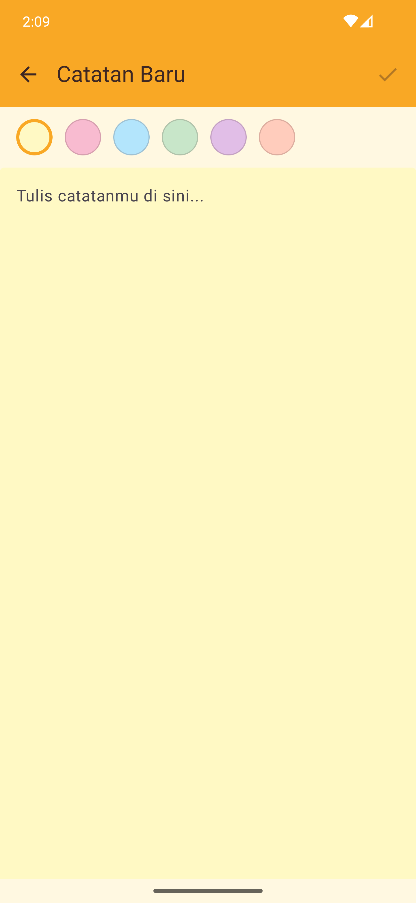
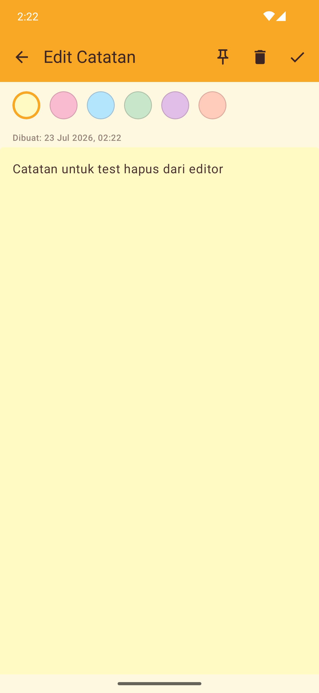
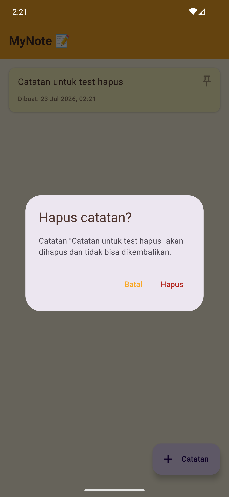

# 📝 MyNote — Aplikasi Sticky Note

Aplikasi catatan sederhana ala sticky note yang dibangun dengan **Jetpack Compose**. Setiap catatan bisa diberi warna kertas sendiri, disematkan (pin) agar selalu tampil di urutan teratas, dan mencatat kapan ia dibuat maupun terakhir diperbarui.

## Identitas Mahasiswa

- **Nama:** Willy Rafael F. Silalahi
- **NIM:** 23083000168
- **Kelas:** 6A2
- **Mata Kuliah:** Pemrograman Mobile
- **Instansi:** Universitas Merdeka Malang

## Screenshots

Semua screenshot diambil langsung dari emulator saat pengujian fitur.

<table>
  <thead>
    <tr>
      <th>No</th>
      <th>Screenshot</th>
      <th>Penjelasan</th>
    </tr>
  </thead>
  <tbody>
    <tr>
      <td>1</td>
      <td></td>
      <td><strong>Dashboard — Empty State.</strong><br>Tampilan awal saat belum ada catatan. Alih-alih layar kosong, aplikasi menampilkan ajakan untuk menekan tombol "+ Catatan" agar pengguna tahu langkah selanjutnya.</td>
    </tr>
    <tr>
      <td>2</td>
      <td></td>
      <td><strong>Dashboard — Daftar Catatan.</strong><br>Menampilkan dua catatan dengan warna kartu berbeda (pink & hijau). Catatan pink sudah di-pin (ikon pin solid) sehingga tetap berada di urutan teratas walau catatan hijau dibuat belakangan. Terlihat juga label waktu "Dibuat" dan "Diperbarui".</td>
    </tr>
    <tr>
      <td>3</td>
      <td></td>
      <td><strong>Editor — Buat Catatan Baru.</strong><br>Baris pemilih warna sticky note di bagian atas, dan kanvas TextField yang langsung mengikuti warna terpilih. Pada mode buat baru, tombol pin & hapus disembunyikan karena catatan belum tersimpan.</td>
    </tr>
    <tr>
      <td>4</td>
      <td></td>
      <td><strong>Editor — Edit Catatan.</strong><br>Mode edit menampilkan tombol pin dan hapus di topbar, riwayat waktu "Dibuat: ...", serta warna yang sedang dipakai catatan (ditandai lingkaran bergaris tebal).</td>
    </tr>
    <tr>
      <td>5</td>
      <td></td>
      <td><strong>Dialog Konfirmasi Hapus.</strong><br>Muncul setelah long-press pada kartu di Dashboard (atau menekan ikon hapus di Editor). Menampilkan cuplikan isi catatan yang akan dihapus, dengan opsi "Batal" atau "Hapus" agar penghapusan tidak terjadi tanpa sengaja.</td>
    </tr>
  </tbody>
</table>

## Daftar Isi

- [Identitas Mahasiswa](#identitas-mahasiswa)
- [Screenshots](#screenshots)
- [Fitur](#fitur)
- [Arsitektur](#arsitektur)
- [Tech Stack](#tech-stack)
- [Struktur Proyek](#struktur-proyek)
- [Cara Menjalankan](#cara-menjalankan)

## Fitur

- **Buat, lihat, dan edit catatan** — satu layar Editor melayani mode buat baru maupun edit, dengan validasi agar catatan kosong tidak bisa disimpan.
- **Warna kartu per catatan** — setiap catatan bisa diberi salah satu dari 6 warna sticky note (kuning, pink, biru, hijau, ungu, oranye) lewat pemilih warna di Editor; kanvas tulisan langsung menampilkan warna yang dipilih secara live.
- **Pin-up catatan** — catatan penting bisa disematkan lewat tombol pin di kartu Dashboard maupun di topbar Editor. Catatan yang di-pin selalu tampil di urutan paling atas daftar.
- **Tanggal & jam dibuat/diperbarui** — setiap kartu mencatat waktu pembuatan (`createdAt`), dan menampilkan waktu pembaruan (`updatedAt`) tambahan begitu catatan pernah diedit.
- **Hapus catatan dengan konfirmasi** — penghapusan bisa dipicu lewat long-press pada kartu di Dashboard atau tombol ikon hapus di Editor, keduanya memunculkan dialog konfirmasi terlebih dahulu agar tidak terhapus tidak sengaja.
- **Empty state** — saat belum ada catatan, Dashboard menampilkan pesan ajakan untuk mulai menulis alih-alih layar kosong.
- **Ikon aplikasi custom** — adaptive icon bertema sticky note (bukan ikon default Android Studio), digambar sebagai vector drawable dari palet warna aplikasi.

## Arsitektur

```
┌─────────────────────────────────────────────────┐
│                 MainActivity                    │
│  └── MyNoteTheme                                │
│       └── MyNoteNavGraph (NavHost)              │
│            ├── DashboardScreen ◄──┐             │
│            └── EditorScreen ──────┘             │
│                                                 │
│  NoteViewModel (satu instance, dibagi bersama)  │
│  └── StateFlow<List<Note>>  ← single source     │
│                               of truth          │
└─────────────────────────────────────────────────┘
```

Pola yang dipakai: **MVVM + Unidirectional Data Flow**.

- `NoteViewModel` adalah satu-satunya sumber kebenaran data, disimpan **in-memory** lewat `MutableStateFlow<List<Note>>` dan bertahan hidup saat rotasi layar (config change) karena mewarisi `ViewModel`.
- Data mengalir turun dari ViewModel ke UI lewat `StateFlow` yang dikoleksi dengan `collectAsStateWithLifecycle()`; event (buat/edit/pin/hapus) mengalir naik dari UI ke ViewModel lewat pemanggilan fungsi biasa — UI tidak pernah memutasi data secara langsung.
- Navigasi antar layar memakai **Navigation Compose**, dengan `NoteViewModel` dibuat satu kali di level `NavGraph` lalu dibagikan ke `DashboardScreen` dan `EditorScreen`, sehingga keduanya selalu melihat data yang sama tanpa perlu mekanisme refresh manual.
- Semua warna UI diambil dari `res/values/colors.xml` lewat `colorResource()` — tidak ada warna hex yang di-hardcode di kode Kotlin.

## Tech Stack

 Komponen | Versi |
---|---|
 Kotlin | 2.2.10 |
 Android Gradle Plugin | 9.2.1 |
 Compose BOM | 2026.02.01 |
 Navigation Compose | 2.9.8 |
 Lifecycle (ViewModel & Runtime Compose) | 2.11.0 |
 `minSdk` / `targetSdk` / `compileSdk` | 26 / 36 / 37 |

Library utama: `androidx.compose.material3`, `androidx.compose.material:material-icons-extended`, `androidx.lifecycle:lifecycle-viewmodel-compose`, `androidx.navigation:navigation-compose`.

## Struktur Proyek

```
app/src/main/java/com/willy/mynote/
├── MainActivity.kt              # Entry point, hanya menyalakan Compose + NavGraph
├── model/
│   ├── Note.kt                  # Data class catatan (id, content, color, isPinned, createdAt, updatedAt)
│   └── NoteColor.kt             # Enum pilihan warna kartu (murni Kotlin, tanpa dependensi Android)
├── viewmodel/
│   └── NoteViewModel.kt         # CRUD + pin + pengurutan tampilan via StateFlow
├── navigation/
│   ├── Screen.kt                # Sealed class rute (Dashboard, Editor)
│   └── MyNoteNavGraph.kt        # NavHost yang menghubungkan Dashboard ↔ Editor
├── ui/
│   ├── theme/
│   │   ├── Theme.kt             # MaterialTheme, warna dari colors.xml
│   │   ├── Type.kt              # Typography
│   │   └── NoteColors.kt        # Pemetaan NoteColor → Color asli
│   └── screens/
│       ├── DashboardScreen.kt   # Daftar catatan, FAB tambah, kartu warna+pin
│       ├── EditorScreen.kt      # Form buat/edit, color picker, pin & hapus
│       ├── DeleteNoteDialog.kt  # Dialog konfirmasi hapus (dipakai bersama)
│       └── NoteFormatting.kt    # Util format tanggal/jam
└── res/
    ├── values/colors.xml        # Single source of truth semua warna
    └── drawable/ic_launcher_*.xml  # Adaptive icon bertema sticky note
```

## Cara Menjalankan

1. Clone repository ini:
   ```bash
   git clone https://github.com/willyrafaelfs/Pemrograman-Mobile-My-Note.git
   ```
   Lalu buka dengan **Android Studio** (disarankan versi yang mendukung Kotlin 2.2.x dan AGP 9.x).
2. Biarkan Gradle sync mengunduh dependency (Compose BOM, Navigation Compose, dsb).
3. Jalankan konfigurasi `app` pada emulator atau perangkat fisik dengan Android **8.0 (API 26)** ke atas.
4. Atau lewat terminal:
   ```bash
   ./gradlew :app:installDebug
   ```
